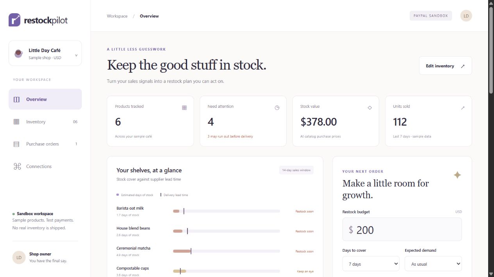
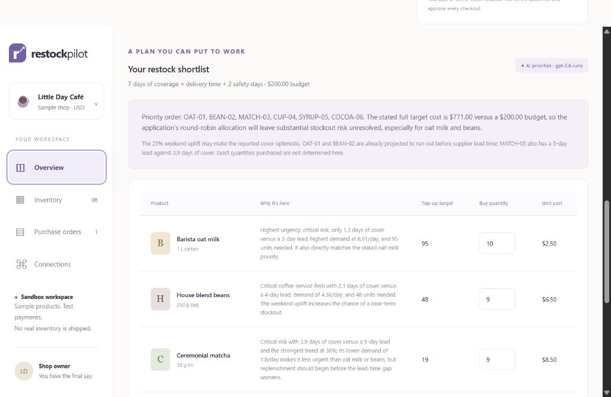
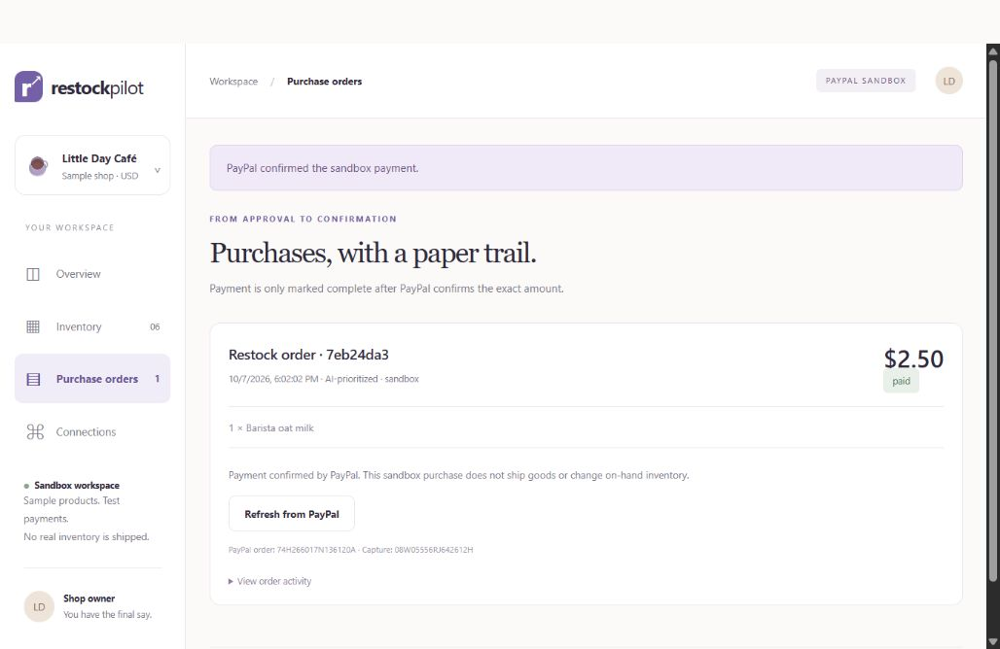

# RestockPilot

**Keep the good stuff in stock.** A local purchasing assistant for small cafés that turns inventory and recent sales into an explainable restocking plan, then takes an owner-reviewed cart through PayPal sandbox approval and capture.

This is a second, separate PayPal AI Hackathon project. Unlike ScopePay’s freelancer scope assessment and invoicing, RestockPilot tackles retail inventory and procurement using the PayPal Orders v2 API.



## Run locally

Requires Node.js 22.17 or newer.

```sh
npm ci
cp .env.example .env
npm start
```

On PowerShell use `Copy-Item .env.example .env`. Open **http://127.0.0.1:4318**.

The calculated preview works without any accounts. It is explicitly labeled **not AI**. Six synthetic café products, their fixed wholesale prices, and fourteen days of sample sales are included. Edit the counts and supplier lead times in Inventory, then save to invalidate old plans.

### AI priorities

Open **Connections → Continue with ChatGPT**. Authorize RestockPilot to use your ChatGPT plan, then select an available model in Overview. Inventory metrics, planning settings, and your shop context are sent to OpenAI when you build an AI plan. The response must rank every known SKU exactly once and provide explanations; malformed or incomplete responses are rejected.

This uses the documented open-source [Sign in with ChatGPT flow](https://developers.openai.com/siwc/token-sharing-open-source/sign-in), with PKCE, state, browser binding, signed identity validation, and explicit plan-sharing scopes. It does not use a separately billed OpenAI API key and never falls back to API billing. Availability and limits depend on your ChatGPT account and this preview integration.

Tokens stay only in server memory. Registration metadata is saved under ignored `data/`; restart requires reconnection. Use Disconnect to revoke the refresh token when possible. Manage plan permissions and usage through ChatGPT’s settings.

### PayPal sandbox

Create a sandbox REST app in the [PayPal Developer Dashboard](https://developer.paypal.com/dashboard/applications/sandbox). Set `PAYPAL_CLIENT_ID` and `PAYPAL_CLIENT_SECRET` in `.env`, then restart. Use sandbox credentials only.

1. Build a plan, adjust the quantities, and review the exact USD total.
2. Tick the approval checkbox and create a PayPal checkout.
3. Open checkout in a browser and approve with a **sandbox personal buyer**, distinct from the app’s sandbox merchant. If your merchant is in India, use a compatible cross-border sandbox buyer for USD testing.
4. Return to Purchase orders and **Refresh from PayPal**.
5. Once PayPal reports approval, click **Capture … sandbox payment**.
6. RestockPilot marks the order paid only after an authenticated PayPal lookup confirms one completed capture matching its local order reference, currency, and exact total.

No real goods are shipped, no on-hand stock is automatically increased, and no production PayPal endpoints are present. The preview may also be used to exercise sandbox checkout, but its purchase record remains explicitly labeled calculated preview. The AI flow must be separately demonstrated for a hackathon entry.

Official integration reference: [PayPal Orders v2](https://developer.paypal.com/api/orders/v2).

## How planning works

- Daily demand = 70% of the recent seven-day average + 30% of the preceding seven-day average, adjusted by the owner’s demand scenario.
- Stock cover = on-hand units / daily demand. Critical means stock may run out before supplier lead time; watch means less than two safety days remain after that lead.
- Top-up target = ceiling(daily demand × (lead days + desired coverage + two safety days)) − current stock, clamped to 0–500 units.
- AI ranks the catalog and explains priorities using these supplied signals and shop context. It cannot set prices, suppliers, budget, or payment authority.
- The server allocates one affordable unit per product per round, in priority order, stopping at targets or the budget. This is a transparent heuristic, not a globally optimal purchasing solver. A restricted budget may leave stockout risks unresolved.
- The owner can adjust quantities up to the forecast target. The server revalidates known SKUs, integer quantities, catalog prices, inventory revision, plan age, and budget before creating an order.

## Payment integrity and limitations

Each saved plan can create only one order. Mutations are serialized within this single server process, persisted atomically, and use stable PayPal request IDs. Network timeouts never trigger automatic creation or capture retries. Refresh an existing order to reconcile an uncertain capture; an uncertain creation without an order ID requires checking the sandbox dashboard before making any replacement. Do not run multiple server processes against the same data directory.

The loopback server checks Host and cross-origin request metadata, restricts static files, uses a strict content security policy, and keeps credentials out of browser responses. It is a **single-owner local prototype**, not a hosted multi-user product. Do not expose the port publicly. Production work would require user authentication, durable transactional storage, verified webhooks, reconciliation tooling, actual suppliers/availability, taxes, delivery costs and addresses, and a validated forecasting model.

## Verification

```sh
npm test
npm run check
```

Automated coverage includes budget and target bounds across thousands of scenarios, hostile carts, stale inventory, duplicate requests, payment mismatch/pending states, network ambiguity, sandbox-only URLs, OAuth verification, and streamed AI completion. Tests use mocked external services; they do not prove that a new installation has completed a real AI request or sandbox purchase.

**Verified on 7 October 2026:** all 21 automated tests passed. Separately, a real ChatGPT GPT-5.6-Luna request produced priorities for a $200 budget and a $771 full target. A real PayPal sandbox order for one synthetic $2.50 oat-milk carton completed buyer approval and capture; the app confirmed the matching capture through PayPal's authenticated Orders API. A transient pre-capture lookup timeout was reconciled before capture; only one capture was requested.





## Files

`server.mjs` serves the app and coordinates orders. `lib/domain.mjs` owns forecasting and validation. `lib/chatgpt.mjs` handles account consent and token lifecycle. `lib/stream.mjs` consumes structured model responses. `lib/providers.mjs` calls PayPal. `public/` is a dependency-free responsive interface. `data/`, `.env`, and local evidence in `artifacts/` are ignored.

MIT licensed. Authentication and SSE plumbing are adapted from ScopePay; the inventory domain, purchasing UI, allocation logic, and Orders integration are new.
